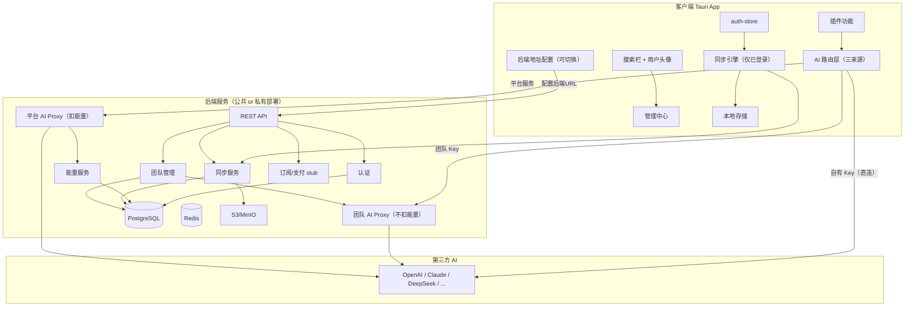
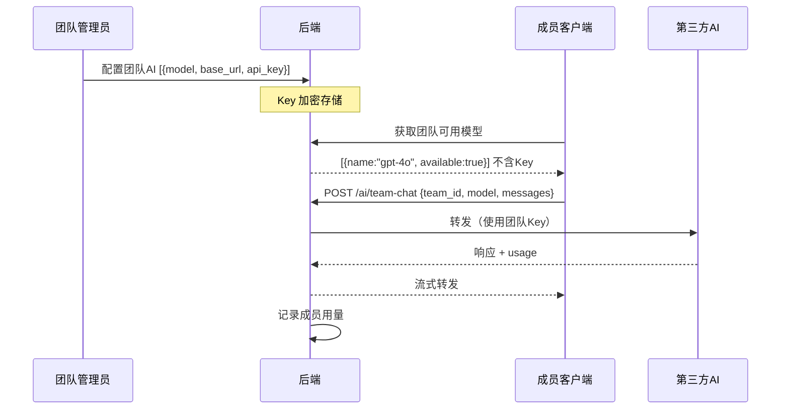
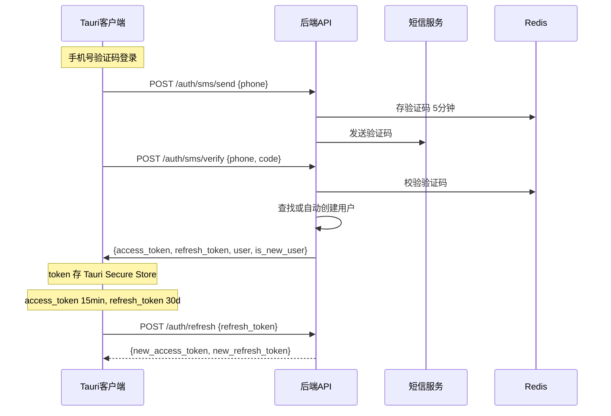
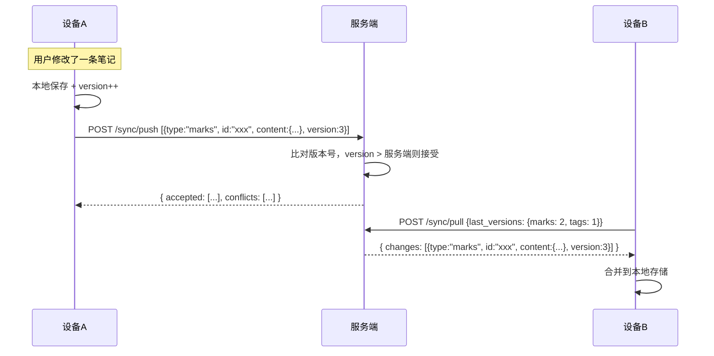
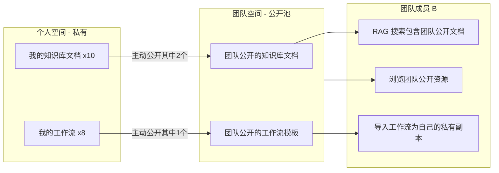

# 51ToolBox 账号体系设计方案 v3

> 参考 uTools 管理中心模式，适配 51ToolBox 的 AI-First Launcher 定位。
> 本项目兼具个人工具和公司工具双重属性，后端支持公共服务和私有部署两种模式。

## 〇、设计原则

- **未登录用户**: 所有本地功能可用（含自有 API Key 的 AI），但**无法同步、无法用平台/团队 AI、无法加入团队**
- **已登录用户**: 解锁数据同步 + 平台 AI 服务 + 团队功能
- **AI 三来源共存**: 自有 Key（免费直连）+ 团队 Key（团队管理员配置，成员免费用）+ 平台服务（按 token 扣能量）
- **后端可私有部署**: 客户端支持切换后端地址，公司可自建一套独立后端，数据完全自主
- **数据不分空间**: 个人和公司数据在同一空间，团队通过「公开」机制共享，**所有数据默认私有**
- **代金券 / 订阅支付**: UI 入口保留，后端暂为 stub
- **团队功能**: 完整实现（创建团队、邀请成员、共享知识库/工作流、团队 AI Key、用量统计）

## 一、整体架构




## 二、后端部署模式

### 2.1 公共服务 vs 私有部署

后端为同一套代码，通过环境变量区分部署模式：

- **公共服务** (`DEPLOY_MODE=public`): 你运维，个人用户和小团队共用，平台 AI 按能量收费
- **私有部署** (`DEPLOY_MODE=private`): 公司 Docker Compose 一键部署，数据完全在内部
- 私有部署可关闭平台 AI 能量计费（公司自己管 Key，不需要能量系统）
- 私有部署的管理员 = 团队 owner，管理所有成员和 AI Key

### 2.2 客户端后端地址配置

- 默认: `https://api.mtools.app`（公共服务）
- 用户可在「设置 > 服务器」中改为公司地址（如 `https://mtools.company.com`）
- **一次只连一个后端**，切换后端 = 重新登录
- 切换不清除本地数据，登录新后端后自动同步

**涉及文件:**

- 改造设置页 — 新增「服务器地址」配置项
- 新增 `src/core/auth/api-client.ts` — HTTP 客户端，读取当前后端地址

## 三、AI 三来源设计（核心差异点）

### 3.1 三种 AI 来源


| 来源     | 配置方       | Key 存储        | 费用           | 需登录 |
| ------ | --------- | ------------- | ------------ | --- |
| 自有 Key | 用户自己      | 客户端本地         | 免费（用户自付API费） | 否   |
| 团队 Key | **团队管理员** | **后端服务器（加密）** | 免费（团队/公司承担）  | 是   |
| 平台服务   | 平台运营      | **后端服务器**     | 按 token 扣能量  | 是   |


用户可按模型粒度混合使用三种来源（如 GPT-4o 用自有Key，DeepSeek 用团队Key，Claude 用平台服务）。

### 3.2 团队 AI Key

团队管理员在**团队设置**中配置共享 API Key，成员看不到 Key 内容：




- Key 只存服务端，客户端只知道有哪些模型可用
- 不消耗成员个人能量
- 服务端记录每个成员用量（token数），供管理员查看简单统计

### 3.3 平台 AI Proxy（扣能量）

`能量消耗 = ceil(input_tokens * input_rate + output_tokens * output_rate) / 1000`

费率表由 `ai_model_pricing` 维护，`GET /ai/models` 返回。

### 3.4 客户端 AI 路由层

```typescript
// src/core/ai/router.ts
interface AIModelConfig {
  id: string;
  name: string;
  source: 'own_key' | 'team' | 'platform';
  own_base_url?: string;
  own_api_key?: string;
  own_model_id?: string;
  team_id?: string;  // 团队模式需要
}

async function routeAIRequest(config: AIModelConfig, req: ChatRequest) {
  switch (config.source) {
    case 'own_key':  return directCall(config, req);      // 直连
    case 'team':     return teamProxyCall(config, req);   // POST /ai/team-chat
    case 'platform': return platformProxyCall(config, req); // POST /ai/chat
  }
}
```

**涉及文件:**

- 新增 `src/core/ai/router.ts`
- 改造 [src/store/ai-store.ts](src/store/ai-store.ts) — 配置增加 `source` + `team_id`
- AI 模型设置页 — 来源下拉（自有Key / 团队 / 平台），团队来源自动列出团队可用模型

## 四、客户端 UI 设计（参考 uTools）

### 4.1 入口：搜索栏用户头像

- **未登录**: 搜索栏右侧显示默认头像图标，点击弹出登录/注册弹窗
- **已登录**: 显示用户头像，点击进入「管理中心」页面
- **涉及文件**: [src/components/search/SearchBar.tsx](src/components/search/SearchBar.tsx) — 右侧新增头像按钮

### 4.2 管理中心页面布局

独立全屏视图（viewId: `"management-center"`），左侧导航 + 右侧内容区：

```
+--------------------------------------------------+
|  管理中心                                    X    |
+------------+-------------------------------------+
| 个人中心    |                                     |
|  我的账号   |  [头像]  用户昵称                    |
|  我的数据   |  157****6203  |  已陪伴你 XX 天      |
|  团队空间   |                                     |
|            |  [升级会员]            免费版         |
| 偏好设置    |                                     |
|  设置       |  ★ 128  AI 能量    购买 AI 能量 >    |
|  AI 模型    |                                     |
|  快捷方式   |  代金券               0张 >          |
|  所有指令   |  AI 能量流水                    >    |
|            |  支付记录                        >    |
| 插件应用市场 |  修改账号                        >    |
|            |  退出账号                        >    |
+------------+-------------------------------------+
```

**左侧导航分区:**

- **个人中心**
  - 我的账号 — 用户信息、AI 能量余额、代金券(入口,暂无逻辑)、支付记录(入口,暂无逻辑)、修改/退出
  - 我的数据 — 同步状态(仅已登录显示)、各类数据统计、数据导入/导出、清除缓存
  - 团队空间 — 创建/加入团队、成员管理、共享知识库、共享工作流模板
- **偏好设置**（整合现有 Settings）
  - 设置 — 通用设置
  - AI 模型 — **三来源配置**：每个模型可选「自有 Key」「团队」「平台服务」
  - 服务器 — 后端地址配置（切换公共/私有部署）
  - 快捷方式 — 快捷键配置
  - 所有指令 — 搜索指令列表
- **插件应用市场** — 现有 Plugin Market 入口

**涉及文件:**

- 新增 `src/plugins/builtin/ManagementCenter/index.tsx` — 管理中心主页面
- 新增 `src/plugins/builtin/ManagementCenter/components/` — 各子页面组件
- 改造 [src/components/settings/](src/components/settings/) — 偏好设置迁移到管理中心内
- 改造 [src/App.tsx](src/App.tsx) — 新增 `"management-center"` 视图路由

### 4.3 登录/注册弹窗

弹窗形式（Modal），支持：

- **手机号 + 验证码登录**（国内市场首选，首次登录自动注册）
- **邮箱 + 密码登录/注册**
- **第三方 OAuth**: 微信扫码、GitHub
- 登录后自动关闭弹窗，触发同步引擎初始化

**涉及文件:**

- 新增 `src/components/auth/LoginModal.tsx`
- 新增 `src/components/auth/PhoneLogin.tsx`
- 新增 `src/components/auth/EmailLogin.tsx`
- 新增 `src/components/auth/OAuthButtons.tsx`

### 4.4 能量不足 / 升级提示

- **内联提示**: 在 AI 对话区显示「平台能量不足，切换到自有 Key 或购买能量 >」
- **弹窗提示**: 达到硬限制时展示套餐对比 + 购买能量入口
- 注意：因为可以用自有 Key，所以不是完全不能用，而是引导用户选择

**涉及文件:**

- 新增 `src/components/auth/UpgradePrompt.tsx`
- 新增 `src/components/auth/EnergyBadge.tsx`

## 五、后端服务设计

### 5.1 技术选型

- **语言**: Rust（与 Tauri 技术栈一致）
- **框架**: Axum
- **数据库**: PostgreSQL
- **缓存**: Redis
- **对象存储**: S3 兼容（MinIO / 阿里云 OSS）
- **短信**: 阿里云短信 / 腾讯云短信
- **支付**: 微信/支付宝（**暂为 stub**）
- **部署**: Docker Compose（公共 / 私有同一镜像）

### 5.2 核心数据模型

```
users (用户表)
├── id (UUID, PK)
├── phone (unique, nullable)         -- 手机号
├── email (unique, nullable)         -- 邮箱
├── username                         -- 昵称
├── avatar_url                       -- 头像 URL
├── password_hash (argon2)           -- 密码哈希（邮箱注册时）
├── plan (free / pro / team)         -- 当前套餐
├── plan_expires_at                  -- 套餐到期时间
├── registered_at                    -- 注册时间（「陪伴天数」）
├── created_at / updated_at

auth_providers (第三方登录绑定)
├── id (PK)
├── user_id → users.id
├── provider (wechat / github)
├── provider_user_id
├── provider_nickname / provider_avatar

ai_energy (AI 能量)
├── user_id → users.id (unique)
├── balance (integer)                -- 当前余额（最小单位，如 0.001 能量 = 1）
├── total_purchased / total_consumed
├── updated_at

ai_energy_logs (AI 能量流水)
├── id (PK)
├── user_id → users.id
├── amount (integer, 正=充值 负=消耗)
├── balance_after                    -- 操作后余额
├── type (consume / gift / purchase / system)
├── model_name                       -- 「gpt-4o」「deepseek-v3」
├── input_tokens / output_tokens     -- 实际 token 用量
├── description                      -- 「AI 对话 - GPT-4o (1.2K tokens)」
├── reference_id                     -- 关联对话/任务 ID
├── created_at

ai_model_pricing (平台模型费率表)
├── model_id (PK)                    -- 「gpt-4o」
├── display_name                     -- 「GPT-4o」
├── provider                         -- 「openai」
├── input_rate                       -- 能量/1K input tokens
├── output_rate                      -- 能量/1K output tokens
├── enabled (bool)                   -- 是否在平台可用
├── updated_at

devices (设备管理)
├── id (UUID, PK)
├── user_id → users.id
├── device_name / platform / app_version / last_seen_at

sync_data (通用同步数据表)
├── id (UUID, PK)
├── user_id → users.id
├── data_type (marks / tags / bookmarks / snippets / workflows / settings)
├── data_id (客户端侧 item id)
├── content (JSONB)
├── version (整数递增)
├── deleted (bool, 软删除)
├── updated_at
├── UNIQUE(user_id, data_type, data_id)

teams (团队)
├── id (UUID, PK)
├── name
├── owner_id → users.id
├── avatar_url
├── created_at / updated_at

team_members (团队成员)
├── team_id → teams.id
├── user_id → users.id
├── role (owner / admin / member)
├── joined_at

team_shared_resources (团队公开资源关系，只存关系不存内容)
├── id (UUID, PK)
├── team_id → teams.id
├── resource_type (knowledge_doc / workflow)
├── resource_id                      -- 个人资源原始 ID
├── owner_id → users.id              -- 资源归属者
├── shared_at
├── description                      -- 公开备注

team_ai_configs (团队 AI Key 配置)
├── id (UUID, PK)
├── team_id → teams.id
├── model_name                       -- 「gpt-4o」
├── display_name                     -- 「GPT-4o」
├── provider                         -- 「openai」
├── base_url                         -- API 地址
├── api_key_encrypted                -- 加密存储的 API Key
├── enabled (bool)
├── created_by → users.id
├── created_at / updated_at

team_ai_usage_logs (团队 AI 用量日志)
├── id (PK)
├── team_id → teams.id
├── user_id → users.id               -- 使用者
├── model_name
├── input_tokens / output_tokens
├── created_at

-- 以下表建表但暂不实现后端逻辑 --

vouchers (代金券, stub)
├── id / user_id / code / amount / status / expires_at

orders (支付订单, stub)
├── id / user_id / type / amount / payment_method / status

subscriptions (订阅记录, stub)
├── id / user_id / plan / period / status / order_id
```

### 5.3 认证流程




- **手机号登录**: 短信验证码，首次自动注册
- **邮箱登录**: 邮箱 + 密码
- **OAuth**: 微信扫码、GitHub
- **Token**: JWT access_token (15min) + opaque refresh_token (30d, 轮换)
- **客户端**: Tauri Secure Store (OS keychain 加密)

### 5.4 API 端点概览

```
# ========== 认证（完整实现） ==========
POST   /auth/sms/send                   -- 发送手机验证码
POST   /auth/sms/verify                  -- 手机号验证码登录/注册
POST   /auth/email/register              -- 邮箱注册
POST   /auth/email/login                 -- 邮箱登录
POST   /auth/refresh                     -- 刷新 token
POST   /auth/logout                      -- 退出登录
GET    /auth/oauth/{provider}/url        -- OAuth 授权链接
POST   /auth/oauth/{provider}/callback   -- OAuth 回调

# ========== 用户（完整实现） ==========
GET    /users/me                         -- 当前用户信息（含 plan, 能量余额）
PATCH  /users/me                         -- 修改昵称/头像
DELETE /users/me                         -- 注销账号
GET    /users/me/devices                 -- 设备列表
DELETE /users/me/devices/:id             -- 移除设备

# ========== AI Proxy + 能量（完整实现） ==========
POST   /ai/chat                          -- 平台 AI 代理（流式，扣能量）
POST   /ai/team-chat                     -- 团队 AI 代理（流式，用团队Key，记用量）
GET    /ai/models                        -- 平台可用模型 + 费率表
GET    /energy/balance                   -- 查询能量余额
GET    /energy/logs                      -- 能量流水（分页）

# ========== 数据同步（完整实现） ==========
POST   /sync/push                        -- 批量上传变更
POST   /sync/pull                        -- 拉取新变更
GET    /sync/status                      -- 各数据类型最新版本号

# ========== 团队（完整实现） ==========
POST   /teams                            -- 创建团队
GET    /teams                            -- 我的团队列表
GET    /teams/:id                        -- 团队详情
PATCH  /teams/:id                        -- 修改团队信息
DELETE /teams/:id                        -- 解散团队
POST   /teams/:id/members               -- 邀请成员
DELETE /teams/:id/members/:uid           -- 移除成员
PATCH  /teams/:id/members/:uid           -- 修改角色
POST   /teams/:id/share                  -- 公开资源到团队
GET    /teams/:id/resources              -- 团队公开资源列表
DELETE /teams/:id/resources/:rid         -- 取消公开
# 团队 AI Key 管理（管理员）
GET    /teams/:id/ai-config              -- 获取团队 AI 配置（含 Key，仅管理员）
PUT    /teams/:id/ai-config              -- 设置团队 AI Key（仅管理员）
GET    /teams/:id/ai-models              -- 获取团队可用模型（成员，不含 Key）
# 团队 AI 用量统计（管理员）
GET    /teams/:id/ai-usage               -- 团队 AI 用量汇总
GET    /teams/:id/ai-usage/:uid          -- 单成员用量明细

# ========== 以下暂为 Stub（保留入口，返回模拟数据） ==========
GET    /plans                            -- 套餐和能量包价目表 (stub: 返回固定数据)
POST   /orders/create                    -- 创建支付订单 (stub: 返回 501)
GET    /orders                           -- 支付记录 (stub: 返回空列表)
GET    /subscriptions/current            -- 当前订阅 (stub: 返回 free)
GET    /vouchers                         -- 代金券列表 (stub: 返回空列表)
POST   /vouchers/redeem                  -- 兑换代金券 (stub: 返回 501)
```

## 六、AI 能量系统（按 token 计量）

### 6.1 核心机制

与 uTools 的固定能量不同，本项目按**实际 token 消耗**计量：

- **仅「平台服务」模式消耗能量**，自有 Key 模式完全免费
- **能量扣减在 AI Proxy 后端自动完成**: 请求转发后，根据 LLM 返回的 `usage` 字段计算消耗
- **客户端无需手动调用扣减 API**: 调 `/ai/chat` 即自动计量
- **注册赠送初始能量**: 让用户体验平台服务模式
- **能量购买**: 保留入口，后端 stub，后续实现支付

### 6.2 能量计算

```
能量消耗 = ceil(input_tokens * input_rate + output_tokens * output_rate) / 1000
```

费率由 `ai_model_pricing` 表维护，客户端通过 `GET /ai/models` 缓存费率表用于预估展示。

### 6.3 客户端能量管理

```typescript
// src/core/auth/energy.ts
interface EnergyService {
  getBalance(): Promise<number>;             // 从服务端获取余额
  getCachedBalance(): number;                // 本地缓存余额（UI 展示用）
  getLogs(page: number, size: number): Promise<EnergyLog[]>;
  estimateCost(model: string, inputTokens: number): number;  // 预估消耗
}

// 注意：不需要 consume() 方法，能量扣减在 /ai/chat 后端自动完成
```

**涉及文件:**

- 改造 [src/store/ai-store.ts](src/store/ai-store.ts) — 平台模式对话前预检查余额，对话后刷新余额
- 改造 [src/store/agent-store.ts](src/store/agent-store.ts) — Agent 的平台模式调用走 `/ai/chat`
- 改造 [src/store/rag-store.ts](src/store/rag-store.ts) — RAG 的 AI 回答走路由层

## 七、数据同步设计

### 7.1 核心规则

- **未登录用户 / 未注册用户**: 完全本地使用，同步功能不可见/不可用
- **已登录用户**: 自动启用同步引擎，数据变更自动推送

### 7.2 同步策略：基于版本号的增量同步




**核心原则:**

- **离线优先**: 所有操作先写本地，登录后 / 网络恢复后同步
- **版本号冲突检测**: push 时服务端比对版本
- **冲突解决**: Last-Write-Wins（默认）
- **软删除**: 标记 `deleted: true`，同步后清理

### 7.3 管理中心「我的数据」页面

- 各数据类型的条目数量和存储大小
- 最后同步时间 + 同步状态指示
- 手动触发全量同步按钮
- 数据导入/导出（JSON 格式，无论是否登录都可用）
- 清除本地缓存
- **未登录时**: 显示「登录后即可多设备同步」提示

### 7.4 客户端同步引擎

```
src/core/sync/
├── engine.ts         # 同步主逻辑（登录后激活，登出后停止）
├── queue.ts          # 变更队列（离线缓冲）
├── conflict.ts       # 冲突检测与解决
├── types.ts          # 同步类型
└── adapters/         # 各数据类型适配器
```

### 7.5 本地存储改造

现有 `JsonCollection` ([src/core/database/index.ts](src/core/database/index.ts)) 扩展:

- 每条记录增加 `_version`、`_syncedAt`、`_dirty` 元数据
- 写操作自动标记 `_dirty: true` 并递增 `_version`
- 同步完成后清除 `_dirty`
- **未登录时**: 元数据照常写入，登录后自动将所有 `_dirty` 数据推送

## 八、用户层级与 Feature Gate

### 8.1 用户状态


| 状态        | 本地功能 | AI 自有Key | AI 团队Key | AI 平台服务 | 数据同步 | 团队     |
| --------- | ---- | -------- | -------- | ------- | ---- | ------ |
| 未登录       | 全部可用 | 可用       | 不可用      | 不可用     | 不可用  | 不可用    |
| 已登录(Free) | 全部可用 | 可用       | 可用（所在团队） | 可用（扣能量） | 可用   | 可创建/加入 |
| 已登录(Pro)  | 全部可用 | 可用       | 可用       | 可用（折扣）  | 可用   | 可创建/加入 |


注：Pro 套餐的具体差异待支付系统上线后定义，当前 Free 和 Pro 功能一致。

### 8.2 客户端 Feature Gate

```typescript
// src/core/auth/feature-gate.ts
type UserState = 'anonymous' | 'free' | 'pro' | 'team';

interface FeatureGate {
  // 核心判断
  isLoggedIn(): boolean;
  getUserState(): UserState;
  
  // 功能检查
  canSync(): boolean;               // 仅已登录
  canUsePlatformAI(): boolean;      // 仅已登录
  canUseTeamAI(): boolean;          // 仅已登录 + 所在团队有 AI 配置
  canUseTeam(): boolean;            // 仅已登录
  hasEnoughEnergy(estimated: number): boolean;
  
  // UI 引导
  showLoginPrompt(feature: string): void;     // 未登录时引导登录
  showEnergyPrompt(): void;                   // 能量不足时引导购买/切换自有Key
}
```

## 九、团队功能设计

### 8.1 团队模型

### 9.1 核心原则：私有优先，按需公开

所有数据（知识库、工作流等）默认都是**用户私有**的，即使在团队版下也不例外。用户可以主动选择将某些资源「公开到团队」，公开后团队成员可查看/使用，但原始数据仍归个人所有。




### 9.2 数据归属与可见性


| 场景            | 数据归属         | 可见性               |
| ------------- | ------------ | ----------------- |
| 用户创建知识库文档     | 个人私有         | 仅自己               |
| 用户将文档「公开到团队」  | **仍归个人**     | 团队成员可见/可在 RAG 中使用 |
| 用户取消公开        | 仍归个人         | 恢复仅自己可见           |
| 用户创建工作流       | 个人私有         | 仅自己               |
| 用户将工作流「公开到团队」 | **原件仍归个人**   | 团队成员可浏览模板         |
| 成员从团队导入工作流    | **生成个人私有副本** | 副本归导入者，与原件无关      |
| 用户退出/被移出团队    | 个人数据不受影响     | 其已公开的资源从团队移除      |
| 团队解散          | 所有个人数据不受影响   | 公开关系清除            |


### 9.3 团队结构与权限

- **创建团队**: 任何已登录用户可创建
- **邀请成员**: 通过邀请码/链接加入（owner/admin 可邀请）
- **角色权限**:
  - **owner**: 全权限（管理团队信息、管理成员、公开/取消任何人的资源）
  - **admin**: 管理成员 + 公开自己的资源 + 取消他人公开的资源
  - **member**: 使用团队公开资源 + 公开自己的资源
- **RAG 搜索范围**: 个人私有文档 + 所在团队的公开文档（可通过开关控制是否包含团队文档）
- **工作流**: 团队公开的工作流作为「模板」展示，成员可一键导入为自己的私有副本

### 9.4 后端数据模型补充

```
team_shared_resources (团队公开资源关系表，只存关系不存内容)
├── id (UUID, PK)
├── team_id → teams.id
├── resource_type (knowledge_doc / workflow)
├── resource_id            -- 个人资源的原始 ID
├── owner_id → users.id    -- 资源所属者
├── shared_at              -- 公开时间
├── description            -- 公开时的备注说明
```

查询时 JOIN 个人数据获取内容，取消公开或退出团队只需删除关系行，个人数据完全不受影响。

### 9.5 涉及文件

- 新增 `src/plugins/builtin/ManagementCenter/components/TeamSpace.tsx` — 团队空间 UI（团队信息、成员管理、公开资源列表）
- 改造 [src/store/rag-store.ts](src/store/rag-store.ts) — RAG 搜索范围支持「个人 + 团队公开」，增加团队文档开关
- 改造 [src/store/workflow-store.ts](src/store/workflow-store.ts) — 增加「从团队模板导入为私有副本」功能
- 知识库列表页 / 工作流列表页 — 每条目增加「公开到团队」/「取消公开」按钮

## 十、需要受账号管理影响的完整模块清单

### 10.1 需要同步的数据模块（仅已登录用户）


| 模块               | 现有存储位置                                  | 改造内容                                   |
| ---------------- | --------------------------------------- | -------------------------------------- |
| Notes/Marks      | `mtools-db/marks.json` (JsonCollection) | 增加同步元数据，接入同步引擎                         |
| Tags             | `mtools-db/tags.json` (JsonCollection)  | 同上                                     |
| Bookmarks        | localStorage `mtools-bookmarks`         | **迁移**到 JsonCollection + 同步            |
| Snippets         | localStorage `mtools-snippets`          | **迁移**到 JsonCollection + 同步            |
| Workflows        | `AppData/workflows/*.json` (Rust)       | 后端增加同步 Tauri command                   |
| AI Config        | `config.json` (Tauri Store)             | 同步模型配置列表（**不含自有 API Key**，仅同步模型名/来源选择） |
| General Settings | `config.json` (Tauri Store)             | 同步通用偏好设置                               |


### 10.2 受 AI 三来源影响的模块

所有 AI 调用接入路由层，根据模型配置决定走自有 Key / 团队 Key / 平台服务：


| 模块               | 涉及文件                                                                         | 改造内容                              |
| ---------------- | ---------------------------------------------------------------------------- | --------------------------------- |
| AI Center        | [src/store/ai-store.ts](src/store/ai-store.ts)                               | 对话调用走 `AIRouter`，平台模式走 `/ai/chat` |
| Smart Agent      | [src/store/agent-store.ts](src/store/agent-store.ts)                         | Agent 多轮调用走 `AIRouter`            |
| Knowledge Base   | [src/store/rag-store.ts](src/store/rag-store.ts)                             | RAG AI 回答走 `AIRouter`             |
| Screen Translate | [src/plugins/builtin/ScreenTranslate/](src/plugins/builtin/ScreenTranslate/) | AI 翻译走 `AIRouter`                 |
| Snippets (动态)    | [src/store/snippet-store.ts](src/store/snippet-store.ts)                     | AI 动态生成走 `AIRouter`               |
| Data Forge       | [src/store/data-forge-store.ts](src/store/data-forge-store.ts)               | AI 脚本生成走 `AIRouter`               |


### 10.3 不需要账号管理的模块（纯本地/设备相关）

- **Clipboard History** — 设备特有，隐私敏感
- **Screen Capture / OCR / Color Picker / QR Code** — 临时操作，无持久化数据
- **System Actions** — 设备特有操作
- **Dev Toolbox** — 纯工具，无数据
- **Image Search** — 临时搜索，无需持久化

### 10.4 插件市场相关

- **已安装插件列表**: 可同步（新设备快速恢复）
- **插件文件本身**: 不同步（各设备独立安装）
- **插件私有数据**: 提供同步 API，由插件自行决定

## 十一、具体涉及的文件改动

### 11.1 新增文件

```
# 后端服务（独立仓库 mtools-server/）
mtools-server/
├── Cargo.toml
├── src/
│   ├── main.rs
│   ├── config.rs
│   ├── routes/
│   │   ├── auth.rs          (手机号/邮箱/OAuth)
│   │   ├── users.rs         (用户信息/设备管理)
│   │   ├── ai_proxy.rs      (AI 转发 + token 计量)
│   │   ├── energy.rs        (AI 能量余额/流水)
│   │   ├── sync.rs          (数据同步 push/pull)
│   │   ├── teams.rs         (团队 CRUD + 共享)
│   │   ├── orders.rs        (支付 stub)
│   │   ├── subscriptions.rs (订阅 stub)
│   │   └── vouchers.rs      (代金券 stub)
│   ├── models/              (数据库模型)
│   ├── middleware/           (JWT 验证、限流)
│   └── services/            (短信、OSS、LLM 转发)
├── migrations/              (SQL 迁移)
└── docker-compose.yml       (PostgreSQL + Redis + MinIO)

# 客户端新增
src/core/auth/
├── index.ts              # AuthService（登录/登出/token 管理）
├── energy.ts             # EnergyService（余额查询/预估/流水）
├── feature-gate.ts       # 功能门控（登录检查/能量检查）
├── types.ts              # User / Energy / Team 类型

src/core/ai/
├── router.ts             # AI 路由层（自有Key vs 平台服务）

src/core/sync/
├── engine.ts             # 同步引擎（登录后激活）
├── queue.ts              # 离线变更队列
├── conflict.ts           # 冲突解决
├── types.ts
└── adapters/

src/store/auth-store.ts   # Zustand: 用户 + 能量 + 登录状态

src/components/auth/
├── LoginModal.tsx        # 登录/注册弹窗
├── PhoneLogin.tsx        # 手机号验证码
├── EmailLogin.tsx        # 邮箱密码
├── OAuthButtons.tsx      # 微信/GitHub
├── UpgradePrompt.tsx     # 升级/购买能量提示
├── EnergyBadge.tsx       # 能量余额展示
└── UserAvatar.tsx        # 搜索栏头像

src/plugins/builtin/ManagementCenter/
├── index.tsx             # 管理中心主页
├── Sidebar.tsx           # 左侧导航
├── components/
│   ├── MyAccount.tsx     # 我的账号
│   ├── MyData.tsx        # 我的数据（同步状态/导入导出）
│   ├── TeamSpace.tsx     # 团队空间（完整：创建/成员/共享）
│   ├── EnergyLogs.tsx    # AI 能量流水
│   ├── PaymentRecords.tsx # 支付记录（stub UI）
│   └── EnergyPurchase.tsx # 购买能量（stub UI）

# Tauri 命令
src-tauri/src/commands/auth.rs     # token 安全存储/刷新
src-tauri/src/commands/sync_v2.rs  # 新版同步
```

### 11.2 需要改造的现有文件


| 文件                                                                                 | 改造内容                                              |
| ---------------------------------------------------------------------------------- | ------------------------------------------------- |
| [src/App.tsx](src/App.tsx)                                                         | 启动时检查登录状态、已登录则初始化同步引擎、新增 management-center 视图     |
| [src/components/search/SearchBar.tsx](src/components/search/SearchBar.tsx)         | 右侧新增用户头像按钮                                        |
| [src/core/database/index.ts](src/core/database/index.ts)                           | JsonCollection 增加 `_version`/`_syncedAt`/`_dirty` |
| [src/store/ai-store.ts](src/store/ai-store.ts)                                     | AI 配置增加 `source` 字段，对话调用走 `AIRouter`              |
| [src/store/agent-store.ts](src/store/agent-store.ts)                               | Agent 调用走 `AIRouter`                              |
| [src/store/rag-store.ts](src/store/rag-store.ts)                                   | RAG AI 走 `AIRouter` + 支持团队共享知识库                   |
| [src/store/workflow-store.ts](src/store/workflow-store.ts)                         | 支持从团队模板导入                                         |
| [src/store/bookmark-store.ts](src/store/bookmark-store.ts)                         | localStorage 迁移到 JsonCollection + 同步              |
| [src/store/snippet-store.ts](src/store/snippet-store.ts)                           | localStorage 迁移到 JsonCollection + 同步              |
| [src/store/data-forge-store.ts](src/store/data-forge-store.ts)                     | AI 调用走 `AIRouter`                                 |
| [src/plugins/builtin/CloudSync/index.tsx](src/plugins/builtin/CloudSync/index.tsx) | 废弃，功能迁入管理中心「我的数据」                                 |
| [src/components/settings/](src/components/settings/)                               | 偏好设置迁入管理中心                                        |
| [src/plugins/builtin/index.ts](src/plugins/builtin/index.ts)                       | 注册 ManagementCenter                               |
| [src-tauri/src/lib.rs](src-tauri/src/lib.rs)                                       | 注册 auth/sync_v2 commands                          |
| [src-tauri/capabilities/default.json](src-tauri/capabilities/default.json)         | 新增后端 API 域名的 HTTP 请求权限                            |


## 十二、建议实施顺序

**阶段一（2-3 周）: 后端服务**

- Axum + PostgreSQL + Redis + Docker Compose（`DEPLOY_MODE` 环境变量区分公共/私有）
- 认证（手机号/邮箱/OAuth + JWT）
- AI Proxy 双通道: 平台通道（扣能量）+ 团队通道（用团队 Key，记用量）
- AI 能量（余额/流水）+ 模型费率表
- 数据同步（push/pull）
- 团队（CRUD + 成员 + 资源公开 + AI Key 管理 + 用量统计）
- 订阅/支付/代金券（建表 + stub）

**阶段二（2 周）: 客户端认证 + 管理中心 UI**

- 后端地址配置（设置 > 服务器，支持切换公共/私有后端）
- 搜索栏头像入口 + 登录弹窗
- 管理中心 UI（我的账号/我的数据/团队空间/偏好设置整合）
- AI 模型配置页：三来源选择（自有 Key / 团队 / 平台服务）
- auth-store + Tauri Secure Store
- 代金券/支付记录页（stub UI + 敬请期待）

**阶段三（2-3 周）: 数据同步 + AI 路由接入**

- JsonCollection 同步元数据改造
- 同步引擎（登录后激活）+ 离线队列
- 逐个接入: Marks -> Tags -> Bookmarks -> Snippets -> Workflows -> Settings
- AI 路由层 `AIRouter`：所有 AI 调用点接入三来源路由
-「我的数据」展示同步状态

**阶段四（1-2 周）: 团队功能**

- 团队空间 UI（创建/加入、成员管理）
- 团队 AI Key 管理页（管理员配置，成员看到可用模型）
- 团队 AI 用量统计面板（管理员查看成员用量）
- 资源公开（知识库/工作流「公开到团队」）
- 团队 RAG 搜索（个人 + 团队公开文档）
- 工作流模板导入（团队模板 -> 个人私有副本）

