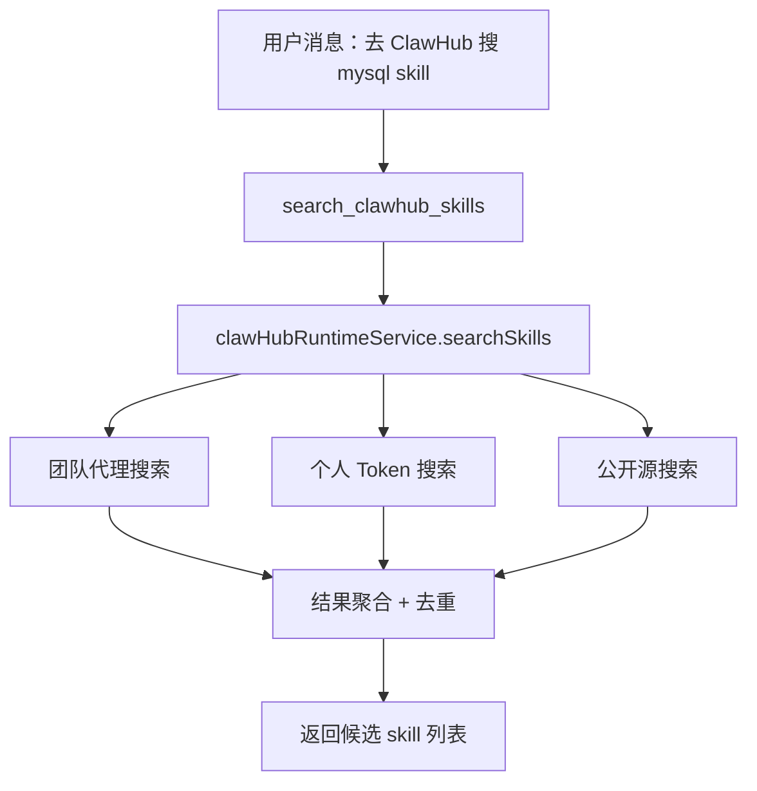
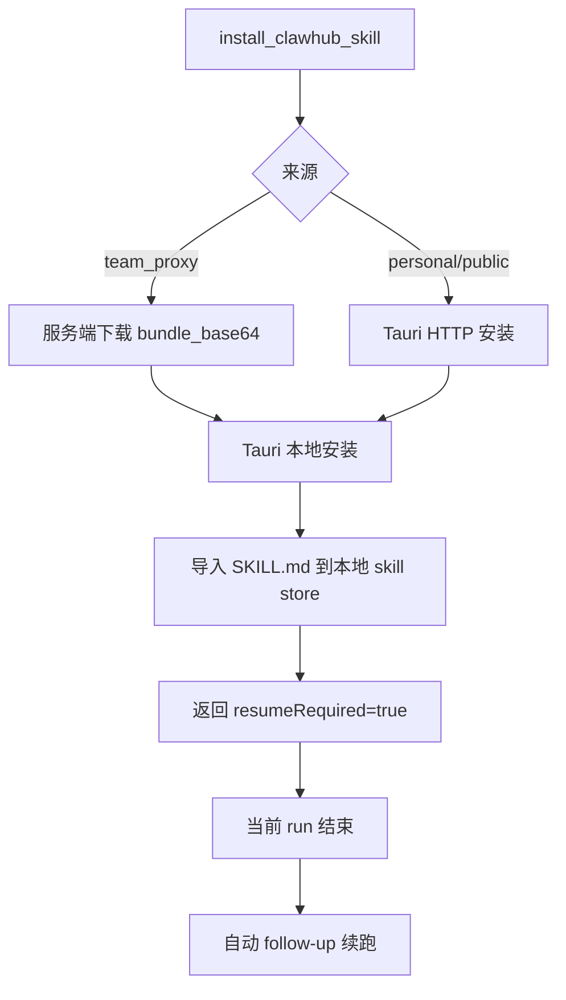
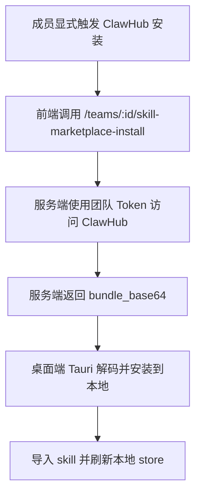

# ClawHub 当前实现文档

本文档描述 `/Users/haichao/Desktop/work/51ToolBox` 当前仓库里 **ClawHub 相关逻辑的真实实现状态**，重点覆盖：

- 产品规则
- 前端 / Agent / Tauri / 服务端链路
- 搜索与安装的数据流
- 团队共享 Token 的边界
- 当前遗留问题与后续建议

本文档基于当前代码实现整理，不是目标态设计稿。

---

## 1. 当前定位

当前项目中的 ClawHub 已被重构为：

- **显式触发的远程 skill 搜索与安装源**
- **不是自动补能力系统**
- **不是团队技能库**
- **不是团队发布中心**

当前边界已经比较明确：

1. **只有用户明确提到 `ClawHub` 时，Agent 才允许调用 ClawHub 相关工具**
2. **团队版 v1 只保留共享 Token**
3. **无论搜索来源来自团队还是个人，安装结果都落到当前用户本地**
4. **地址已经被收口到官方 `https://clawhub.ai/`**

---

## 2. 产品规则

### 2.1 显式触发规则

当前显式触发判定在：

- `/Users/haichao/Desktop/work/51ToolBox/src/core/agent/skills/clawhub-runtime-service.ts`

函数：

- `isExplicitClawHubRequest(text)`

当前规则：

- 文本中必须包含 `clawhub`（大小写不敏感）
- 同时包含搜索 / 查找 / 安装语义词之一：
  - `搜`
  - `搜索`
  - `找`
  - `查`
  - `安装`
  - `download`
  - `install`

不满足时，会返回固定拒绝文案：

- `当前消息未显式要求去 ClawHub 搜索 skill，请先明确说明“去 ClawHub 搜...”`

### 2.2 模型行为约束

当前在：

- `/Users/haichao/Desktop/work/51ToolBox/src/plugins/builtin/SmartAgent/core/react-agent.ts`

系统提示中已经写死规则：

- 未明确提到 ClawHub 时，**禁止自动搜索**
- 未明确提到 ClawHub 时，**禁止自动推荐**
- 未明确提到 ClawHub 时，**禁止自动安装**

### 2.3 团队边界

当前团队侧只保留：

- 团队共享 Token 配置
- 团队配置状态查询
- 团队代理搜索
- 团队代理下载 bundle

已经从主链路移除：

- 团队技能库
- 团队发布 UI
- 团队缓存运营入口
- 团队安装日志入口

注意：

- 服务端代码里仍残留部分旧函数和旧数据结构，但**已经不在对外主路由中暴露**

---

## 3. 模块总览

## 3.1 前端与 Agent 层

### 核心文件

- `/Users/haichao/Desktop/work/51ToolBox/src/core/agent/skills/clawhub-runtime-service.ts`
- `/Users/haichao/Desktop/work/51ToolBox/src/core/agent/skills/clawhub-config.ts`
- `/Users/haichao/Desktop/work/51ToolBox/src/core/agent/skills/clawhub-team-api.ts`
- `/Users/haichao/Desktop/work/51ToolBox/src/core/agent/skills/clawhub-tauri.ts`
- `/Users/haichao/Desktop/work/51ToolBox/src/core/agent/skills/skill-persistence.ts`
- `/Users/haichao/Desktop/work/51ToolBox/src/core/agent/skills/types.ts`
- `/Users/haichao/Desktop/work/51ToolBox/src/plugins/builtin/SmartAgent/core/default-tools.ts`
- `/Users/haichao/Desktop/work/51ToolBox/src/plugins/builtin/SmartAgent/core/react-agent.ts`
- `/Users/haichao/Desktop/work/51ToolBox/src/plugins/builtin/SmartAgent/hooks/use-agent-effects.ts`
- `/Users/haichao/Desktop/work/51ToolBox/src/core/agent/actor/middlewares/tool-resolver.ts`
- `/Users/haichao/Desktop/work/51ToolBox/src/core/agent/cluster/local-agent-bridge.ts`

## 3.2 UI 层

- `/Users/haichao/Desktop/work/51ToolBox/src/components/ai/ClawHubSkillMarketplaceSection.tsx`
- `/Users/haichao/Desktop/work/51ToolBox/src/plugins/builtin/ManagementCenter/components/team/TeamAIConfigSection.tsx`

## 3.3 Tauri / 本地运行时层

- `/Users/haichao/Desktop/work/51ToolBox/src-tauri/src/commands/skill_marketplace.rs`
- `/Users/haichao/Desktop/work/51ToolBox/src-tauri/src/lib.rs`

## 3.4 服务端团队代理层

- `/Users/haichao/Desktop/work/51ToolBox/mtools-server/src/routes/teams.rs`
- `/Users/haichao/Desktop/work/51ToolBox/mtools-server/Dockerfile`
- `/Users/haichao/Desktop/work/51ToolBox/mtools-server/.env.example`

---

## 4. 当前前端实现

## 4.1 统一运行时服务：`clawHubRuntimeService`

文件：

- `/Users/haichao/Desktop/work/51ToolBox/src/core/agent/skills/clawhub-runtime-service.ts`

当前暴露 4 个核心能力：

1. `isExplicitClawHubRequest(text)`
2. `searchSkills(goal, context)`
3. `installSkill(candidate, context)`
4. `listInstalledSkills()`

### 4.1.1 搜索逻辑

搜索顺序固定为：

1. `team_proxy`
2. `personal_registry`
3. `public_registry`

实现细节：

- 团队搜索通过 `/teams/:id/skill-marketplace-search`
- 个人 / 公开搜索通过 Tauri 命令 `skill_marketplace_clawhub_search`
- 搜索结果会按 `slug + version` 去重
- 同一个 skill 若多个来源都有，优先级：
  - `team_proxy`
  - `personal_registry`
  - `public_registry`
  - `legacy_cli`

### 4.1.2 安装逻辑

安装分两类：

#### A. 团队来源 `team_proxy`

流程：

1. 前端调用团队服务端接口 `/teams/:id/skill-marketplace-install`
2. 服务端返回 `bundle_base64`
3. 前端再调用 Tauri `skill_marketplace_clawhub_install`
4. Tauri 在本地解码并安装 bundle
5. 安装后的 `SKILL.md` 被导入本地 skill store

#### B. 个人 / 公开来源

流程：

1. 前端直接调用 Tauri `skill_marketplace_clawhub_install`
2. Tauri 直接访问 ClawHub HTTP 接口下载 bundle
3. 在本地解压并导入 skill

### 4.1.3 安装后的本地注册

安装完成后，前端会调用：

- `importMarketplaceSkillFromMd(...)`

文件：

- `/Users/haichao/Desktop/work/51ToolBox/src/core/agent/skills/skill-persistence.ts`

写入的 marketplace 元数据包括：

- `provider = clawhub`
- `slug`
- `remoteVersion`
- `installedVersion`
- `installedVia = personal | team`
- `sourceKind`
- `teamId`
- `siteUrl`
- `registryUrl`
- `bundleRootPath`
- `bundleHash`
- `originUrl`
- `installedAt`

### 4.1.4 已安装 skill 列表

`listInstalledSkills()` 当前通过读取本地 skill store 中：

- `source === "marketplace"`
- `marketplaceMeta.provider === "clawhub"`

来过滤出 ClawHub 安装项。

---

## 5. 当前 ClawHub 配置逻辑

## 5.1 个人配置

文件：

- `/Users/haichao/Desktop/work/51ToolBox/src/core/agent/skills/clawhub-config.ts`

当前个人配置存储在：

- Tauri Store 文件：`skill-marketplace.json`
- key：`clawhub_personal_config`

字段：

- `siteUrl`
- `registryUrl`
- `token`
- `updatedAt`

### 当前特殊点

虽然结构里还有 `siteUrl` / `registryUrl`，但当前保存逻辑已经被锁死为：

- `https://clawhub.ai`

也就是说：

- **用户现在只能配 Token**
- **不能再配其他站点地址**

### 旧地址迁移

以下旧值会自动归一：

- `https://clawhub.com`
- `https://registry.clawhub.com`

都会映射成：

- `https://clawhub.ai`

## 5.2 团队配置

前端 API 封装：

- `/Users/haichao/Desktop/work/51ToolBox/src/core/agent/skills/clawhub-team-api.ts`

团队配置接口：

- `GET /teams/:id/skill-marketplace-config`
- `PUT /teams/:id/skill-marketplace-config`
- `GET /teams/:id/skill-marketplace-status`
- `POST /teams/:id/skill-marketplace-config/verify`
- `POST /teams/:id/skill-marketplace-search`
- `POST /teams/:id/skill-marketplace-install`

### 当前特殊点

团队保存接口也已经锁死：

- `site_url = https://clawhub.ai`
- `registry_url = https://clawhub.ai`

所以团队 UI 现在只配置：

- Token
- `is_active`

不会再暴露地址输入框。

### 团队侧展示

管理中心仍然显示一块 “ClawHub 技能中心”，但内容已经收口为：

- 当前是否启用
- 当前是否已保存 Token
- 官方地址固定为 `https://clawhub.ai/`
- 服务端代理是否可用

---

## 6. 当前 UI 逻辑

## 6.1 技能中心页

文件：

- `/Users/haichao/Desktop/work/51ToolBox/src/components/ai/ClawHubSkillMarketplaceSection.tsx`

当前包含 3 部分：

1. **个人 Token 配置**
2. **团队共享 Token 状态展示**
3. **手动搜索 / 手动安装**

### 当前产品行为

- 页面允许用户手动搜索 ClawHub skill
- 页面允许用户直接点安装
- 这条页面入口**不受显式触发限制**
- 显式触发限制只针对 Agent 工具链

## 6.2 团队管理页

文件：

- `/Users/haichao/Desktop/work/51ToolBox/src/plugins/builtin/ManagementCenter/components/team/TeamAIConfigSection.tsx`

当前只承担：

- 团队共享 Token 配置
- 状态查看
- 验证配置

已经不再承担：

- 团队技能发布
- 团队技能库运营
- 团队缓存管理

---

## 7. 当前 Agent 接入逻辑

## 7.1 暴露给模型的工具

文件：

- `/Users/haichao/Desktop/work/51ToolBox/src/plugins/builtin/SmartAgent/core/default-tools.ts`

当前对 Agent 暴露两个工具：

1. `search_clawhub_skills`
2. `install_clawhub_skill`

### `search_clawhub_skills`

特点：

- 只读工具
- 要求 `goal`
- 可选 `limit`
- 执行前会检查当前消息是否显式提到 ClawHub

### `install_clawhub_skill`

特点：

- 危险工具 `dangerous: true`
- 参数：
  - `slug`
  - `version?`
  - `source`
- 执行前也会检查显式触发
- 安装成功后会触发续跑调度

## 7.2 续跑机制

当前续跑调度在两个地方接入：

- `/Users/haichao/Desktop/work/51ToolBox/src/plugins/builtin/SmartAgent/hooks/use-agent-effects.ts`
- `/Users/haichao/Desktop/work/51ToolBox/src/core/agent/actor/middlewares/tool-resolver.ts`

逻辑是：

1. `install_clawhub_skill` 安装成功
2. 返回 `resumeRequired = true`
3. 调度 follow-up
4. follow-up 默认文案：
   - `已安装所需 ClawHub skill，请继续处理刚才任务`

## 7.3 当前 run 的结束策略

文件：

- `/Users/haichao/Desktop/work/51ToolBox/src/plugins/builtin/SmartAgent/core/react-agent.ts`

当前当 `install_clawhub_skill` 返回：

- `installed = true`
- `resumeRequired = true`

时，当前 run 会结束，并给出说明：

- 当前 run 到此结束
- 新 skill 会在下一次 run 中生效

这样做的原因是：

- 当前 run 内无法热替换完整工具集 / skill 集
- 需要下一次 run 重新走 `SkillMiddleware + ToolResolver`

---

## 8. 当前 Tauri 本地运行时实现

核心文件：

- `/Users/haichao/Desktop/work/51ToolBox/src-tauri/src/commands/skill_marketplace.rs`

命令注册：

- `/Users/haichao/Desktop/work/51ToolBox/src-tauri/src/lib.rs`

已注册命令：

1. `skill_marketplace_clawhub_status`
2. `skill_marketplace_clawhub_verify`
3. `skill_marketplace_clawhub_search`
4. `skill_marketplace_clawhub_install`

## 8.1 `status`

返回：

- `installed`
- `version`
- `binary`
- `mode`
- `site_url`
- `registry_url`

当前实现即便本机没装 CLI，也会报告：

- `installed: true`
- `mode: http` 或 `hybrid`

含义是：

- 当前主实现是内置 HTTP runtime
- CLI 只是 fallback

## 8.2 `verify`

优先走：

- HTTP API 验证

候选接口：

- `/api/v1/auth/whoami`
- `/api/v1/me`
- `/api/v1/profile`

如果 HTTP 失败且本机装了 `clawhub` CLI，则回退到：

- `clawhub login --token ...`
- `clawhub whoami`

## 8.3 `search`

优先走 HTTP：

- `/api/v1/search?q=...`
- `/api/v1/search?query=...`

返回 JSON 后会用一套通用 JSON 遍历逻辑，从响应中提取：

- `slug`
- `title`
- `description`
- `version`
- `origin_url`

如果 HTTP 失败且本机装了 CLI，则回退到：

- `clawhub search <query>`

并解析命令行文本输出。

## 8.4 `install`

安装有 3 条路径：

### A. 团队代理下发 `bundle_base64`

如果请求带了 `bundle_base64`：

- 直接本地解码
- 写入应用数据目录
- 安装完成

### B. 本地 HTTP 直装

如果没有 `bundle_base64`：

1. 访问 ClawHub HTTP 下载接口
2. 获取 zip bundle 或 `skill_md`
3. 安装到本地目录

### C. CLI fallback

当 HTTP 安装失败且本机有 `clawhub` CLI` 时：

- 调用 `clawhub install`
- 在 CLI 安装目录中寻找 `SKILL.md`

## 8.5 本地 bundle 存储目录

当前安装目录：

- `AppData/skill-bundles/clawhub/<slug>/<version>/`

安装完成后：

- 计算 `bundleHash`
- 寻找 `SKILL.md`
- 返回 `bundle_root_path`

## 8.6 legacy fallback

如果下载结果不是 zip，而是纯文本 `SKILL.md`：

- 仍会落盘为 `SKILL.md`
- `legacy_fallback = true`

这说明当前仍兼容“只有 `SKILL.md`，没有完整 bundle”的旧 skill 形态。

---

## 9. 当前服务端团队代理实现

核心文件：

- `/Users/haichao/Desktop/work/51ToolBox/mtools-server/src/routes/teams.rs`

当前对外实际暴露的团队 ClawHub 路由只有：

- `GET /teams/:id/skill-marketplace-config`
- `PUT /teams/:id/skill-marketplace-config`
- `GET /teams/:id/skill-marketplace-status`
- `POST /teams/:id/skill-marketplace-config/verify`
- `POST /teams/:id/skill-marketplace-install`
- `POST /teams/:id/skill-marketplace-search`

## 9.1 团队配置存储

数据库表：

- `team_skill_marketplace_configs`

配置内容：

- `provider`
- `site_url`
- `registry_url`
- `api_token`（加密）
- `is_active`

当前服务端保存时会强制把地址写成：

- `https://clawhub.ai`

## 9.2 团队状态接口

状态接口现在只保留当前主链路真正需要的字段：

- `configured`
- `active`
- `site_url`
- `registry_url`
- `service_ready`
- `can_search`
- `can_install`

当前语义：

- 只要团队配置启用且 token 可用，就认为 `service_ready = true`
- 服务端不再对外暴露 `cli_installed` / `cli_version` / `service_mode`
- 团队侧语义已经明确收口为：**HTTP 代理 + 共享 Token**

## 9.3 团队验证

验证逻辑：

- 读取加密 token
- 走 `run_server_clawhub_verify_http(...)`
- 当前主路径已是 HTTP 代理

## 9.4 团队搜索

团队搜索逻辑：

1. 读取团队共享 token
2. 访问 ClawHub HTTP 接口
3. 解析搜索结果
4. 写入 30 秒内存缓存

缓存 key：

- `team_id`
- `provider`
- `query`
- `limit`

缓存 TTL：

- 30 秒

## 9.5 团队安装

团队安装逻辑：

1. 服务端使用团队 token 访问 ClawHub HTTP 下载接口
2. 获取 bundle bytes
3. 转成 `bundle_base64`
4. 返回给客户端

重要：

- **服务端不会替成员本地直接安装 skill**
- 服务端只负责代理下载
- 真正安装仍在桌面端本地完成

这和当前产品规则一致：

- 团队仅提供共享认证能力
- 安装结果归成员本地

---

## 10. 当前地址策略

前后端当前都已经收口：

- `DEFAULT_CLAWHUB_SITE_URL = https://clawhub.ai`
- `DEFAULT_CLAWHUB_REGISTRY_URL = https://clawhub.ai`

旧地址兼容规则：

- `https://clawhub.com` → `https://clawhub.ai`
- `https://registry.clawhub.com` → `https://clawhub.ai`

当前实际效果：

- 个人侧 UI 不再允许填地址
- 团队侧 UI 不再允许填地址
- 服务端保存团队配置时也强制用官方地址

---

## 11. 当前数据流

## 11.1 Agent 显式触发搜索

## 11.2 Agent 安装并续跑

## 11.3 团队代理安装

---

## 12. 当前仍然存在的问题

## 12.1 服务端主链路旧代码已做一轮清理

目前 `mtools-server/src/routes/teams.rs` 已经完成一轮主链路收口：

- 已删除未暴露路由对应的旧 handler
- 已删除团队缓存同步 / 团队已发布技能 / 团队安装日志对应的主文件内遗留结构
- 已删除服务端 `clawhub` CLI fallback 主实现
- 团队状态接口已去掉 `cli_installed` / `cli_version` / `service_mode`

当前结论：

- **服务端团队 ClawHub 主链路已经收口为纯 HTTP 代理**
- **团队 v1 的服务端职责已经和产品定义一致**

## 12.2 当前仍保留桌面端 CLI fallback

当前主实现已经是 HTTP runtime，但桌面端 Tauri 侧仍保留本机 `clawhub` CLI fallback。

意义：

- 本机 HTTP 下载异常时还有一个兼容兜底

问题：

- 代码复杂度更高
- 调试路径变多
- 容易让人误以为 CLI 仍然是正式链路的一部分

## 12.3 显式触发规则仍是简单规则匹配

当前 `isExplicitClawHubRequest` 是固定规则，不是模型理解：

- 必须带 `ClawHub`
- 还要带 搜 / 查 / 找 / 安装 等词

好处：

- 简单可控
- 不会误伤普通对话

不足：

- 可能出现误判
- 用户表达如果不在规则里，会被拒绝

## 12.4 HTTP 接口解析依赖启发式 JSON 遍历

无论是桌面端还是服务端，当前都在用“宽松 JSON 提取逻辑”解析：

- `slug`
- `download_url`
- `origin_url`
- `version`

好处：

- 对接口兼容性较宽

风险：

- 如果 ClawHub 官方返回结构变化较大，当前解析逻辑会失效
- 缺少强 schema 契约

## 12.5 手动 UI 搜索不受显式触发限制

当前限制只约束 Agent 工具链。

但技能中心页中的手动搜索框：

- 可以直接搜
- 不要求显式提到 ClawHub

这不一定是 bug，但需要明确：

- **Agent 入口是显式触发**
- **手动技能中心入口是人工主动操作**

这两条线是不同产品语义。

## 12.6 团队状态接口已完成一轮瘦身

这一轮清理后，团队状态接口已经不再暴露：

- `cli_installed`
- `cli_version`
- `can_sync`
- `cached_count`
- `last_synced_at`

说明：

- 服务端返回字段已经更贴近当前产品真实语义
- 剩余需要继续评估的历史包袱，主要转移到了桌面端 CLI fallback 与文档层

---

## 13. 当前验证状态

本轮已验证：

- 前端 TypeScript 编译通过
- `mtools-server` `cargo check` 通过

已知非 ClawHub 主逻辑问题：

- `pnpm tauri:build` 在 macOS 上仍会卡在 DMG bundling 的 `bundle_dmg.sh`
- 这属于打包链问题，不是 ClawHub 运行时主逻辑问题

---

## 14. 部署与重打包要求

如果你修改了以下任一部分，需要**重新打桌面端**：

- `src/**`
- `src-tauri/**`

如果你修改了以下任一部分，需要**重新打服务端 Docker 镜像**：

- `mtools-server/src/routes/teams.rs`
- `mtools-server/Dockerfile`
- `mtools-server/.env.example`

### 当前判断

- **测试个人 ClawHub**：重打客户端即可
- **测试团队共享 Token / 团队代理搜索安装**：客户端 + 服务端镜像都要更新

---

## 15. 当前最准确的一句话总结

当前项目里的 ClawHub 已经从“自动补能力 + 团队技能市场 + CLI 主导”切换为：

- **显式触发**
- **HTTP 主链路**
- **团队只共享 Token**
- **安装始终本地化**

但代码层面仍有一部分历史遗留尚未完全删除，尤其在：

- `/Users/haichao/Desktop/work/51ToolBox/mtools-server/src/routes/teams.rs`

---

## 16. 建议的下一步清理顺序

如果下一轮继续收口，我建议按这个顺序：

1. 删除 `mtools-server` 中已退出主路由的旧 ClawHub 代码
2. 删掉团队状态接口里的旧字段
3. 给 ClawHub HTTP 返回结构补更强的 schema 校验
4. 明确 UI 上“手动技能中心”与“Agent 显式触发”的区别说明
5. 再决定是否彻底删除桌面端 / 服务端 CLI fallback

---

## 17. 角色视角使用说明

## 17.1 普通成员怎么用

普通成员当前有两条使用路径：

### 路径 A：在 Agent / 对话中显式触发

成员需要明确说出类似：

- `去 ClawHub 搜一个 mysql 的 skill`
- `从 ClawHub 安装一个 dingtalk skill`
- `去 ClawHub 查一下有没有 sql export skill`

当前系统会：

1. 允许模型调用 `search_clawhub_skills`
2. 返回候选
3. 用户确认后允许调用 `install_clawhub_skill`
4. 安装到当前用户本地
5. 自动续跑当前任务

### 路径 B：手动进入技能中心搜索

成员也可以直接打开：

- `/Users/haichao/Desktop/work/51ToolBox/src/components/ai/ClawHubSkillMarketplaceSection.tsx`

对应的界面入口

在这里可以：

- 配个人 Token
- 手动搜索
- 手动点安装

注意：

- 这条路径是“用户主动打开技能中心”
- 不需要经过 Agent 的显式触发规则

## 17.2 团队管理员怎么用

团队管理员当前只需要做一件事：

- 在团队管理页配置共享 ClawHub Token

操作位置：

- `/Users/haichao/Desktop/work/51ToolBox/src/plugins/builtin/ManagementCenter/components/team/TeamAIConfigSection.tsx`

管理员能做的事情：

1. 输入团队共享 Token
2. 启用 / 关闭团队共享配置
3. 点击验证
4. 查看服务端代理是否 ready

管理员当前**不需要**做的事情：

- 不需要维护团队技能库
- 不需要发布团队 skill
- 不需要同步团队技能市场缓存

## 17.3 开发者怎么调试

如果你是开发者，建议按这条顺序验证：

1. 先测个人 Token
2. 再测公开搜索
3. 再测团队共享 Token
4. 最后再测 Agent 显式触发与 follow-up 续跑

推荐最小调试路径：

1. 打开技能中心
2. 配一个个人 Token
3. 点“验证个人 Token”
4. 手动搜索一个 skill
5. 手动安装一个 skill
6. 再测试 Agent 说 `去 ClawHub 搜...`

---

## 18. 显式触发示例

## 18.1 允许触发的表达

当前大概率会通过的表达：

- `去 ClawHub 搜一个 mysql skill`
- `从 ClawHub 安装一个 dingtalk skill`
- `帮我在 ClawHub 找一下 SQL 导出 skill`
- `去 clawhub 查一下 postgres 的 skill`
- `ClawHub install 一个 mongodb skill`

原因：

- 包含 `ClawHub`
- 同时有 搜 / 找 / 查 / 安装 / install / download 语义

## 18.2 不允许触发的表达

当前不会通过的表达：

- `帮我找个 skill`
- `有没有适合这个任务的插件`
- `缺什么你自己装`
- `去搜一下工具`
- `查一下有没有这个能力`

原因：

- 没有明确提到 `ClawHub`

## 18.3 容易误判的边界案例

下面这些可能因为规则过于刚性而失败：

- `ClawHub 有 mysql skill 吗`
- `想用 ClawHub 做一个 sql 导出`
- `ClawHub 里面 mysql skill 推荐哪个`

因为当前规则不只是要求提到 `ClawHub`，还要求命中：

- `搜`
- `搜索`
- `找`
- `查`
- `安装`
- `download`
- `install`

这也是当前实现的一个局限。

---

## 19. 接口 / 命令总表

## 19.1 前端运行时接口

文件：

- `/Users/haichao/Desktop/work/51ToolBox/src/core/agent/skills/clawhub-runtime-service.ts`

### `isExplicitClawHubRequest(text)`

- 用途：判断当前消息是否允许进入 ClawHub 工具链

### `searchSkills(goal, context)`

- 用途：聚合搜索
- 来源顺序：团队代理 → 个人 Token → 公开源

### `installSkill(candidate, context)`

- 用途：执行本地安装
- 支持来源：
  - `team_proxy`
  - `personal_registry`
  - `public_registry`

### `listInstalledSkills()`

- 用途：列出当前本地已安装的 ClawHub skills

## 19.2 Agent 工具

文件：

- `/Users/haichao/Desktop/work/51ToolBox/src/plugins/builtin/SmartAgent/core/default-tools.ts`

### `search_clawhub_skills`

参数：

- `goal`
- `limit?`

返回：

- `entries[]`

### `install_clawhub_skill`

参数：

- `slug`
- `version?`
- `source`

返回：

- `installed`
- `skillId`
- `bundleRootPath`
- `resumeRequired`
- `resumePrompt`

## 19.3 Tauri 命令

文件：

- `/Users/haichao/Desktop/work/51ToolBox/src-tauri/src/commands/skill_marketplace.rs`
- `/Users/haichao/Desktop/work/51ToolBox/src-tauri/src/lib.rs`

命令列表：

- `skill_marketplace_clawhub_status`
- `skill_marketplace_clawhub_verify`
- `skill_marketplace_clawhub_search`
- `skill_marketplace_clawhub_install`

## 19.4 服务端团队接口

文件：

- `/Users/haichao/Desktop/work/51ToolBox/mtools-server/src/routes/teams.rs`

当前主路由：

- `GET /teams/:id/skill-marketplace-config`
- `PUT /teams/:id/skill-marketplace-config`
- `GET /teams/:id/skill-marketplace-status`
- `POST /teams/:id/skill-marketplace-config/verify`
- `POST /teams/:id/skill-marketplace-search`
- `POST /teams/:id/skill-marketplace-install`

---

## 20. 常见问题与排错

## 20.1 团队页还显示旧地址 `.com`

原因通常有两个：

1. 当前客户端还是旧包
2. 服务端 / 数据库仍保留旧配置，但当前新版读取时理论上会归一显示

建议排查：

1. 确认桌面端是否重打包
2. 确认服务端镜像是否已更新
3. 打开团队配置页重新保存一次团队 Token

## 20.2 团队页显示“服务端暂不可代理搜索/安装”

常见原因：

1. 团队 Token 没填
2. 团队配置没启用
3. 服务端访问外网的 `https://clawhub.ai` 失败
4. 服务端拿到 token 但验证接口不通过

建议排查：

1. 点击“验证团队 ClawHub 配置”
2. 查看 `mtools-server` 日志
3. 确认服务器能访问 `https://clawhub.ai`

## 20.3 手动搜索能用，但 Agent 不会搜

这通常不是 bug，而是显式触发规则在生效。

排查方法：

- 看用户消息里是否真的写了 `ClawHub`
- 看是否也写了 搜 / 找 / 查 / 安装 等词

例如：

- `帮我找个 mysql skill` → 不会触发
- `去 ClawHub 搜一个 mysql skill` → 会触发

## 20.4 安装成功，但当前轮对话没有立刻使用新 skill

这是当前设计行为，不是 bug。

原因：

- 新 skill 不会在当前 run 内热插入工具集
- 当前 run 会结束
- 下一次 follow-up run 才重新加载新 skill

## 20.5 团队共享 Token 已配置，但成员安装后别的成员看不到

这也是当前设计行为。

原因：

- 团队 Token 只提供共享认证能力
- 安装结果仍然落到“当前触发成员”的本地
- 不会同步成团队公共 skill 库

## 20.6 `pnpm tauri:build` 失败

当前已知和 ClawHub 主逻辑无直接关系的问题：

- macOS DMG bundling 的 `bundle_dmg.sh` 可能失败

它不代表：

- ClawHub 搜索失败
- ClawHub 安装失败
- ClawHub 团队代理失败

它更像是打包链路问题。

---

## 21. 当前代码清理建议

如果目标是把 ClawHub 这块做到“代码和产品边界一致”，建议继续做以下收口：

### 第一层：继续删文档和迁移层面的旧痕迹

重点文件：

- `/Users/haichao/Desktop/work/51ToolBox/mtools-server/src/routes/teams.rs`

这部分主文件内的旧 handler / 旧状态字段已经做过一轮清理。

接下来更值得继续收的，是：

- 过时设计文档
- 不再使用的 migration / 表结构说明
- 仍把服务端描述为 CLI 主导的说明文本

### 第二层：决定是否彻底删除桌面端 CLI fallback

### 第三层：增强接口稳定性

建议给以下链路加更强 schema 校验：

- Tauri `search` HTTP 返回解析
- Tauri `install` HTTP 返回解析
- 服务端 `search` / `install` HTTP 返回解析

### 第四层：进一步清理 legacy 地址兼容层

当前还保留：

- `https://clawhub.com`
- `https://registry.clawhub.com`

作为历史值自动归一化兼容。

当前价值：

- 能兼容旧配置和旧数据库记录

代价：

- 阅读代码时容易误以为多地址仍是正式能力

如果历史数据已经迁完，可以继续考虑把兼容分支再收紧。

### 第五层：决定是否彻底删除 CLI fallback

当前 CLI fallback 的价值：

- 某些 HTTP 接口变动时还能兜底

它的代价：

- 调试复杂
- 误导团队以为 CLI 仍是主链路
- 代码体积更大

如果你已经确认官方 HTTP 接口足够稳定，可以考虑彻底删掉。

---

## 22. 最终建议

如果你现在的目标是“尽快把 ClawHub 功能做稳定”，我建议优先级如下：

1. 保持当前产品边界不再变化
2. 先把团队共享 Token + 本地安装链路验证稳定
3. 再决定是否删除桌面端 CLI fallback
4. 顺手清理文档 / legacy 兼容层

对于当前项目来说，最重要的不是再加新能力，而是：

- 把 **显式触发**
- **团队共享 Token**
- **本地安装**
- **follow-up 续跑**

这四条主线彻底稳定下来。
