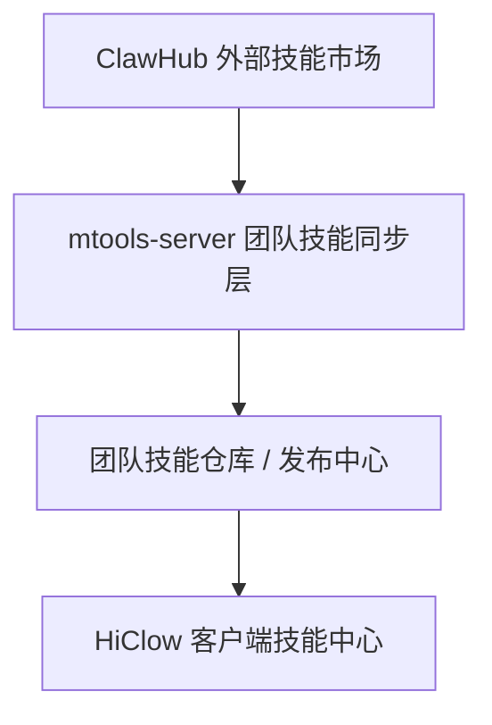

# 团队技能中心最优解设计文档

## 1. 目的

本文档用于明确 `HiClow` 接入 `ClawHub` / Skill Center 时，**团队场景下的最优产品方案与技术方案**。

目标不是只解决“怎么把 token 配上去”，而是回答以下问题：

- 团队技能中心的**最终正确形态**是什么
- 当前已实现方案处于什么阶段
- 为什么“客户端直接拿 token”不是好方案
- 为什么“服务端代理安装”比它更好，但依然不是终局
- 如果要做到可长期交付、可运维、可审计、可扩展，服务端、客户端、数据模型、权限模型应该怎么设计

本文档重点讨论：

- `ClawHub` / Skill Marketplace 团队接入
- 团队 token 托管
- 团队技能同步 / 发布 / 安装
- 团队与个人配置共存策略

本文档不包含：

- AI 模型路由优化
- OCR / RAG / 数据导出设计
- `mtools-server` 之外的第三方权限系统

---

## 2. 当前状态总结

### 2.1 已实现的阶段

当前项目已经具备以下能力：

#### V1

- 支持个人配置 `ClawHub`
- 支持本地通过 `clawhub` CLI 按 `slug` 安装 skill
- 支持将 `SKILL.md` 导入当前 Skill 系统

#### V2

- 支持团队级 `ClawHub` 配置
- 团队 token 存储在服务端数据库中
- 团队 token 以加密形式存储
- 团队模式下，成员安装 skill 时由服务端代理调用 `clawhub`
- 团队模式下，客户端不再需要拿到明文 token

### 2.2 当前实现的优点

- 比“每个成员都配 token”好很多
- 比“服务端把 token 明文下发给客户端”安全很多
- 保持了现有 Skill 系统兼容性
- 对当前代码入侵较小，能尽快落地

### 2.3 当前实现仍然不是终局

原因很简单：

- 成员每次安装 skill 时，服务端都还要**临时访问外部 ClawHub**
- 服务端仍依赖 `clawhub` CLI 运行环境
- 团队还没有形成“团队自己的技能目录”
- 缺乏版本锁定、团队发布、灰度、审计、缓存治理

也就是说，当前实现属于：

> **可用、合理、显著优于早期方案，但还不是团队产品的终局最优解**

---

## 3. 最优解结论

## 3.1 一句话结论

团队场景下的**最优解**不是：

- 成员直接连接 `ClawHub`
- 服务端每次临时代理安装

而是：

> **团队技能仓库 / 团队技能发布中心**

即：

1. 管理员配置 `ClawHub` 团队源
2. 服务端同步、缓存、解析技能
3. 管理员把某个技能版本“发布到团队”
4. 成员只消费“团队已发布技能”
5. 成员不直接接触外部市场与 token

---

## 4. 为什么这是最优解

## 4.1 安全性最优

如果成员机器拿到团队 token，本质上就意味着：

- token 可被抓包
- token 可被日志泄漏
- token 可被复制到其他设备
- token 可绕开团队治理直接访问外部资源

即使现在已经改成服务端代理安装，只要成员每次安装仍直接触发外部市场访问，也依然存在：

- 服务端外部依赖抖动风险
- 临时运行失败影响成员体验

而“团队技能仓库模式”可以把风险集中在服务端，并且做到：

- token 永远只保留在服务端
- 成员请求永远面向自家平台
- 外部市场仅作为上游源，而不是实时依赖

## 4.2 产品体验最优

成员真正想看到的是：

- 团队推荐技能
- 团队允许使用的技能
- 已经审核过的技能
- 可以稳定安装/启用的技能

成员并不需要理解：

- `ClawHub`
- token
- registry
- site_url
- skill slug 的外部组织结构

所以从产品视角看：

- **管理员负责外部连接**
- **成员只消费团队资产**

才是正确心智。

## 4.3 运维与治理最优

如果没有团队技能仓库，后面会遇到很多治理问题：

- 团队到底允许哪些 skill
- 某个 skill 升级后谁来验证
- 线上要不要固定版本
- 出问题怎么回滚
- 谁在什么时候发布了哪个版本
- 某个 skill 是否默认启用
- 某个 skill 是否只给特定成员可见

这些问题都不是“成员实时从外部市场安装”能优雅解决的。

---

## 5. 最优目标架构

建议把整个系统分成四层：



### 5.1 外部市场层

职责：

- 提供上游 skill 元数据
- 提供 skill 安装包 / `SKILL.md`
- 提供版本信息

它不直接面向团队成员。

### 5.2 服务端同步层

职责：

- 保存团队 `ClawHub` 配置
- 安全托管 token
- 调用 `clawhub` 或未来官方 API
- 拉取 skill 元数据与版本信息
- 缓存 `SKILL.md` / 原始包 / 索引信息

### 5.3 团队技能仓库层

职责：

- 表示“团队正式可用的技能”
- 做版本固定
- 做启用/禁用
- 做灰度/审计/发布

### 5.4 客户端消费层

职责：

- 只展示团队已发布技能
- 支持启用 / 禁用 / 安装到本地
- 不接触外部 token
- 不直接依赖外部市场

---

## 6. 推荐产品模型

## 6.1 角色模型

### 管理员

负责：

- 配置 `ClawHub` 团队 token
- 触发同步技能
- 选择技能版本
- 发布到团队
- 下线或回滚版本

### 成员

负责：

- 浏览团队已发布技能
- 安装或启用团队技能
- 使用技能

成员不负责：

- 配 token
- 理解上游市场细节
- 处理版本风险

### 高级用户 / 开发者

保留个人模式：

- 自己配置个人 token
- 安装个人私有 skill
- 调试阶段本地测试 skill

但个人模式应该明确是：

> 补充能力，不是团队正式分发路径

---

## 7. 目标流程设计

## 7.1 团队配置流程

1. 管理员打开团队管理页
2. 配置：
   - `site_url`
   - `registry_url`
   - `token`
3. 点击“验证配置”
4. 服务端验证成功后保存

### 当前实现状态

已具备：

- 团队配置保存
- 团队配置验证
- token 加密存储

## 7.2 团队同步流程

目标流程：

1. 管理员点击“同步 ClawHub 技能”
2. 服务端使用团队 token 从 ClawHub 拉取技能元数据
3. 服务端把元数据写入“团队外部技能缓存表”
4. 管理员可浏览同步结果

### 注意

这里的“同步”不等于“成员立即可用”。

同步只是把上游市场能力同步到团队后台。

## 7.3 团队发布流程

目标流程：

1. 管理员在同步结果中选择某个 skill
2. 选择要发布的版本
3. 服务端拉取对应 skill 的 `SKILL.md` / 包
4. 服务端解析并校验
5. 管理员点击“发布到团队”
6. 写入“团队技能发布表”

### 发布后

成员只看到：

- 这个 team skill
- 当前发布版本
- 状态是否可用

## 7.4 成员安装流程

1. 成员打开技能中心
2. 选择“团队技能”
3. 看到团队已发布 skill 列表
4. 点击安装 / 启用
5. 客户端从服务端读取缓存的 `SKILL.md`
6. 导入本地 Skill 系统

整个过程：

- 不访问外部 `ClawHub`
- 不需要团队 token
- 不依赖成员本机安装 `clawhub`

---

## 8. 分阶段实施建议

## 阶段 A：当前已完成

### 目标

先把“团队 token 不下发客户端”做对。

### 已完成内容

- 团队 token 服务端托管
- 团队配置保存与验证
- 团队模式服务端代理安装
- 前端切换到团队代理模式

### 价值

- 这是第一道安全底线

## 阶段 B：下一阶段，建议优先做

### 目标

从“服务端代理安装”升级到“团队技能缓存 / 发布”

### 要做的事

- 增加“外部技能同步缓存表”
- 增加“团队技能发布表”
- 增加“团队技能列表接口”
- 增加“管理员同步 / 发布 UI”
- 成员只读团队已发布 skill

### 收益

- 成员侧更稳定
- 服务端不再每次实时访问外部市场
- 可做团队治理

## 阶段 C：终局治理

### 目标

变成真正的企业级团队技能中心

### 要做的事

- 版本锁定
- 回滚
- 审计日志
- 安装统计
- 灰度发布
- 默认启用规则
- 可见性控制

---

## 9. 推荐数据模型

以下为推荐模型，不要求一次性全部实现。

## 9.1 团队技能市场配置表

建议用途：

- 保存团队对某个 marketplace 的连接信息

当前已有雏形：

- `team_skill_marketplace_configs`

建议字段：

- `id`
- `team_id`
- `provider`
- `site_url`
- `registry_url`
- `api_token`
- `is_active`
- `created_by`
- `updated_by`
- `created_at`
- `updated_at`

## 9.2 团队外部技能缓存表

建议新增表：

- `team_skill_marketplace_cache`

作用：

- 保存从 ClawHub 同步到的技能元数据

建议字段：

- `id`
- `team_id`
- `provider`
- `slug`
- `name`
- `description`
- `latest_version`
- `versions_json`
- `author`
- `tags_json`
- `icon_url`
- `raw_metadata_json`
- `last_synced_at`

### 价值

- 同步一次，多端复用
- 不必每次成员打开页面都实时请求上游

## 9.3 团队技能发布表

建议新增表：

- `team_published_skills`

作用：

- 团队正式启用哪些 skill

建议字段：

- `id`
- `team_id`
- `provider`
- `slug`
- `version`
- `display_name`
- `description`
- `skill_md`
- `raw_bundle_path`
- `status`
- `default_enabled`
- `published_by`
- `updated_by`
- `created_at`
- `updated_at`

### 关键点

- 成员只消费这个表中的数据
- 这是“团队技能目录”的核心表

## 9.4 团队技能安装记录表

建议新增表：

- `team_skill_install_logs`

作用：

- 记录成员安装、启用、失败情况

建议字段：

- `id`
- `team_id`
- `user_id`
- `published_skill_id`
- `action`
- `status`
- `error_message`
- `created_at`

## 9.5 审计日志表

建议新增表：

- `team_skill_audit_logs`

记录：

- 谁配置了 token
- 谁验证了 marketplace
- 谁同步了 skill
- 谁发布了 skill
- 谁回滚了版本
- 谁停用了 skill

---

## 10. 推荐接口设计

## 10.1 已有接口

当前已具备：

- `GET /teams/:id/skill-marketplace-config`
- `PUT /teams/:id/skill-marketplace-config`
- `POST /teams/:id/skill-marketplace-config/verify`
- `POST /teams/:id/skill-marketplace-install`

这些接口更偏向 **V2 服务端代理安装**。

## 10.2 下一阶段建议新增接口

### 同步外部技能

- `POST /teams/:id/skill-marketplace-sync`

作用：

- 服务端同步技能市场元数据到本地缓存

### 获取同步缓存列表

- `GET /teams/:id/skill-marketplace-cache`

作用：

- 管理员查看已同步技能

### 发布团队技能

- `POST /teams/:id/published-skills`

请求体示例：

```json
{
  "provider": "clawhub",
  "slug": "team/sql-export",
  "version": "1.2.0"
}
```

### 查询团队已发布技能

- `GET /teams/:id/published-skills`

作用：

- 成员技能中心读取团队正式可用技能

### 下线 / 回滚

- `PATCH /teams/:id/published-skills/:skillId`

支持：

- 启用 / 禁用
- 标记默认启用
- 切版本

### 获取成员安装记录

- `GET /teams/:id/published-skills/:skillId/install-logs`

---

## 11. 客户端 UI 设计建议

## 11.1 团队管理页

建议拆成三个区域：

### 区域 1：团队连接配置

- site_url
- registry_url
- token
- 保存
- 验证

### 区域 2：外部技能同步

- 同步按钮
- 最近同步时间
- 同步状态
- 外部 skill 列表

### 区域 3：团队发布管理

- 已发布 skill 列表
- 当前版本
- 发布 / 更新 / 下线 / 回滚

## 11.2 成员技能中心

建议拆成两个来源：

- 团队技能
- 个人技能

### 团队技能

展示：

- 技能名
- 描述
- 版本
- 是否团队推荐
- 是否已安装
- 启用 / 禁用按钮

### 个人技能

继续保留：

- 本地创建 skill
- `SKILL.md` 导入
- 个人 `ClawHub` 安装

---

## 12. 权限策略建议

## 12.1 最小可用版本

### 管理员

可做：

- 配置 token
- 验证
- 同步外部技能
- 发布 / 下线团队技能

### 成员

可做：

- 查看团队已发布技能
- 安装 / 启用团队技能

不可做：

- 查看明文 token
- 直接同步外部技能
- 发布团队技能

## 12.2 后续可扩展权限

未来可以细化为：

- `skill_admin`
- `skill_operator`
- `skill_viewer`

但第一版不建议把权限系统做太复杂。

---

## 13. 安全建议

## 13.1 token 永不下发客户端

团队 token 必须满足：

- 不进入成员客户端 JS
- 不写入前端 store
- 不进入浏览器日志
- 不进入 Tauri 本地配置文件

## 13.2 服务端命令执行隔离

如果继续通过 `clawhub` CLI 调用，建议：

- 独立临时工作目录
- 独立临时 config 文件
- 执行后及时清理
- 禁止复用全局共享用户态配置

## 13.3 缓存文件策略

对于同步到服务端的 skill 内容：

- `SKILL.md` 可缓存
- 原始 bundle 可选缓存
- 对缓存内容保存摘要 hash
- 支持重复发布时复用缓存

## 13.4 审计必备

至少记录：

- 谁配置了 token
- 谁验证过 token
- 谁同步了技能
- 谁发布了技能
- 谁安装失败

---

## 14. 运维建议

## 14.1 服务端必须具备的条件

如果当前仍通过 CLI 调用：

- 服务端必须安装 `clawhub`
- 服务端必须能访问外部 `ClawHub`
- 服务端必须有临时目录写权限

## 14.2 更优长期方向

如果未来 `ClawHub` 提供稳定官方 API，则建议逐步从 CLI 迁移到 API：

- 运维更稳定
- 错误信息更结构化
- 更适合服务端同步和缓存

但在官方 API 能力不明确之前，CLI 是可接受的过渡方案。

---

## 15. 与当前仓库代码的映射

## 15.1 当前已落地的关键文件

### 服务端

- `/Users/haichao/Desktop/work/HiClow/mtools-server/src/routes/teams.rs`
  - 团队 `ClawHub` 配置读写
  - 团队配置验证
  - 团队 skill 代理安装

- `/Users/haichao/Desktop/work/HiClow/mtools-server/src/main.rs`
  - 明文 token 加密迁移

- `/Users/haichao/Desktop/work/HiClow/mtools-server/migrations/20260324110000_add_team_skill_marketplace_configs.sql`
  - 团队 skill marketplace 配置表

### 客户端

- `/Users/haichao/Desktop/work/HiClow/src/components/ai/ClawHubSkillMarketplaceSection.tsx`
  - 技能中心 UI
  - 个人与团队来源切换

- `/Users/haichao/Desktop/work/HiClow/src/core/agent/skills/clawhub-team-api.ts`
  - 团队配置接口
  - 团队验证接口
  - 团队代理安装接口

- `/Users/haichao/Desktop/work/HiClow/src/plugins/builtin/ManagementCenter/components/team/TeamAIConfigSection.tsx`
  - 团队管理页的 ClawHub 配置与验证

### 本地 Tauri

- `/Users/haichao/Desktop/work/HiClow/src-tauri/src/commands/skill_marketplace.rs`
  - 个人模式下本地 `clawhub` CLI 能力

---

## 16. 推荐后续开发顺序

建议严格按下面顺序推进：

### Step 1：稳定当前 V2

- 完善服务端 CLI 健康检查
- 明确服务端未安装 `clawhub` 的 UI 提示
- 增加错误提示与日志

### Step 2：加团队同步缓存

- 做技能市场同步缓存表
- 加同步接口
- 管理页展示同步结果

### Step 3：加团队发布中心

- 选择版本发布到团队
- 团队成员只读团队已发布技能

### Step 4：加审计与统计

- 发布日志
- 安装日志
- 失败原因

### Step 5：加版本治理

- 锁定版本
- 回滚版本
- 默认启用

---

## 17. 最终建议

如果只问一句：

> 团队技能中心最优解是什么？

答案就是：

> **团队 token 只在服务端；服务端同步和缓存外部技能；管理员把技能发布到团队；成员只消费团队已发布技能。**

当前已经实现的“服务端代理安装”是正确方向，但还只是中间态。

如果要把它做成真正成熟、长期可交付的企业级产品，下一步必须从：

> **代理安装**

升级到：

> **团队技能仓库 / 团队技能发布中心**

---

## 18. 可执行落地结论

基于当前项目现状，建议后续明确分成两条线：

### 线 A：短期交付线

- 保留当前团队代理安装模式
- 解决服务端 `clawhub` 健康状态展示
- 把错误提示和验证链路做扎实

### 线 B：中期正确化线

- 增加团队技能同步缓存
- 增加团队发布目录
- 成员只消费团队已发布技能

这样既不会阻塞当前上线，也不会把错误架构越做越深。
